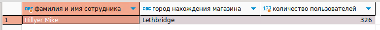
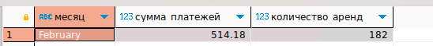
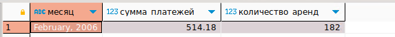

# Домашнее задание к занятию «SQL. Часть 2» - Михалёв Сергей

---

### Задание 1

Одним запросом получите информацию о магазине, в котором обслуживается более 300 покупателей, и выведите в результат следующую информацию: 
- фамилия и имя сотрудника из этого магазина;
- город нахождения магазина;
- количество пользователей, закреплённых в этом магазине.

**Решение**

```
SELECT CONCAT_WS(' ', st.last_name, st.first_name) AS 'фамилия и имя сотрудника', 
ct.city AS 'город нахождения магазина', 
COUNT(c.customer_id) AS 'количество пользователей'  
FROM store s 
JOIN customer c ON s.store_id = c.store_id 
JOIN address a ON a.address_id = s.store_id 
JOIN city ct ON ct.city_id = a.city_id
JOIN staff st ON st.staff_id = s.store_id 
GROUP BY s.store_id HAVING COUNT(c.customer_id) > 300;
```

- результат
  
  

---

### Задание 2

Получите количество фильмов, продолжительность которых больше средней продолжительности всех фильмов.

**Решение**

```
SELECT COUNT(f.film_id) AS 'количество фильмов, продолжительность которых больше средней'
FROM film f
WHERE f.length > (SELECT AVG(length) FROM film);
```

- результат
  
  

---

### Задание 3

Получите информацию, за какой месяц была получена наибольшая сумма платежей, и добавьте информацию по количеству аренд за этот месяц.

**Решение 1**

В задании не сказано о разделенни данных по годам. Более того, контора может захотеть проанализировать в какой период года наибольшее количество продаж.
Потому оставляю первое решение, за ним последует вариант с разделение на годы с использовнаие DATE_FORMAT. 

```
SELECT MONTHNAME(DATE(p.payment_date)) AS месяц, SUM(p.amount) AS сумма_платежей, COUNT(p.rental_id) AS количество_аренд
FROM payment p 
GROUP BY MONTHNAME(DATE(p.payment_date))
ORDER BY сумма_платежей LIMIT 1;
```

- результат
  
  


**Решение 2**

```
SELECT DATE_FORMAT(p.payment_date, '%M, %Y') AS месяц, SUM(p.amount) AS сумма_платежей, COUNT(p.rental_id) AS количество_аренд
FROM payment p 
GROUP BY месяц
ORDER BY сумма_платежей LIMIT 1;
```

- результат
  
  


