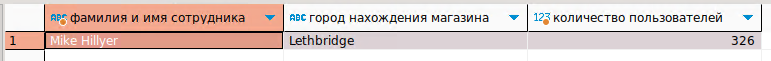
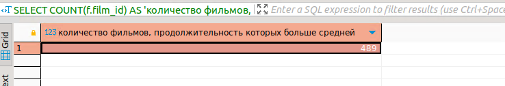

# Домашнее задание к занятию «SQL. Часть 2» - Михалёв Сергей

---

### Задание 1

Одним запросом получите информацию о магазине, в котором обслуживается более 300 покупателей, и выведите в результат следующую информацию: 
- фамилия и имя сотрудника из этого магазина;
- город нахождения магазина;
- количество пользователей, закреплённых в этом магазине.

**Решение**

```
SELECT CONCAT_WS(' ', st.last_name, st.first_name) AS 'фамилия и имя сотрудника', 
ct.city AS 'город нахождения магазина', 
COUNT(c.customer_id) AS 'количество пользователей'  
FROM store s 
JOIN customer c ON s.store_id = c.store_id 
JOIN address a ON a.address_id = s.store_id 
JOIN city ct ON ct.city_id = a.city_id
JOIN staff st ON st.staff_id = s.store_id 
GROUP BY s.store_id HAVING COUNT(c.customer_id) > 300;
```

- результат
  
  

---

### Задание 2

Получите количество фильмов, продолжительность которых больше средней продолжительности всех фильмов.

```
SELECT COUNT(f.film_id) AS 'количество фильмов, продолжительность которых больше средней' FROM film f
WHERE f.length > (SELECT AVG(length) FROM film);
```

- результат
  
  

### Задание 3

Получите информацию, за какой месяц была получена наибольшая сумма платежей, и добавьте информацию по количеству аренд за этот месяц.


## Дополнительные задания (со звёздочкой*)
Эти задания дополнительные, то есть не обязательные к выполнению, и никак не повлияют на получение вами зачёта по этому домашнему заданию. Вы можете их выполнить, если хотите глубже шире разобраться в материале.

### Задание 4*

Посчитайте количество продаж, выполненных каждым продавцом. Добавьте вычисляемую колонку «Премия». Если количество продаж превышает 8000, то значение в колонке будет «Да», иначе должно быть значение «Нет».

### Задание 5*

Найдите фильмы, которые ни разу не брали в аренду.
